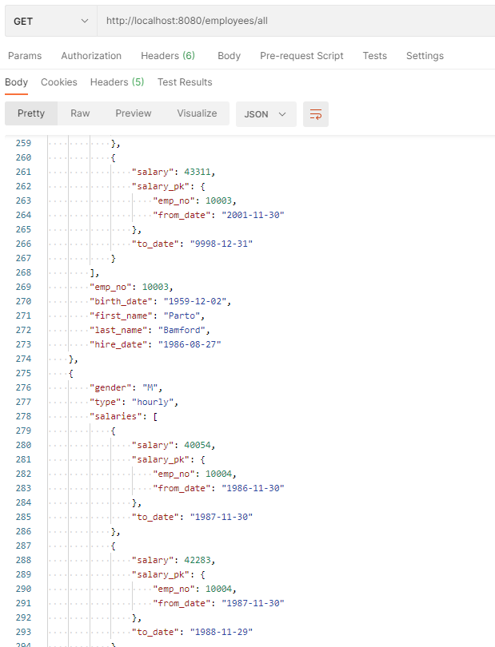
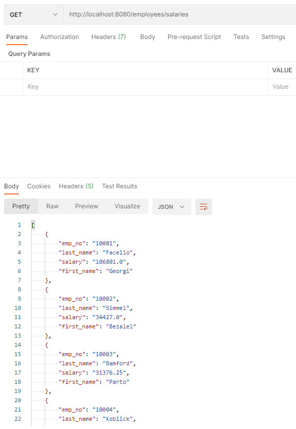

# Salary Calculator

Spring Boot Employee Salary Calculator project.       
Backed by SQL tables from [this](https://dev.mysql.com/doc/employee/en/sakila-structure.html) sample with some edits (extra salary type column);  
The project demonstrates a **salary calculator that is based on the employees type (salaried, commission, hourly).**

## Implementation
- Added a new abstract class [`SalaryCalculator`](src/main/java/com/chen/salarycalc/entities/salaries/SalaryCalculator.java) to keep the employee entity as clean as possible.  
In addition, I created a factory (following the design pattern) class [`SalaryFactory`](src/main/java/com/chen/salarycalc/entities/salaries/SalaryFactory.java) for this object, increasing future flexibility.
- Employee Data Access Layer [`EmployeeDAL`](src/main/java/com/chen/salarycalc/dal/EmployeeDAL.java) (logging, exception handling).
- Added a `type` column in the employee table.
- SQL script [`employees.sql`](employees.sql) is present.

## Set up the environment

After creating the schema on the MySQL Server,  
We need to setup the project to connect to the MySQL database by configuring some parameters.  

Navigate to:

`application.properties`

In the `application.properties` file we have 3 parameters:

1. `spring.datasource.url`
    MySQL Server IP:PORT and Schema name.

2. `spring.datasource.username` and `spring.datasource.password`
    MySQL Credentials.

    
## Running the application

#### Running the application using an IDE

##### Note: 
    you can run the main() method in the application which will start the spring
    boot server (uses port 8080 by default).

 

## Unit Tests

There are several unit tests which cover some basic functionality **(JUnit, Mockito)**.

##### Run the unit tests from your IDE:

Open `EmployeeControllerTest` class and run each test separately or all of them at once by 
  clicking the `play button`.
